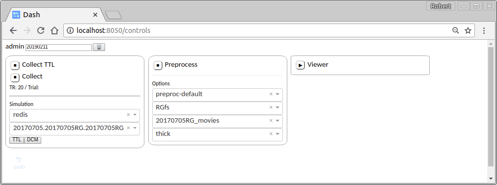

Controls
========

A simple web interface allows you to start and stop the various processes involved in a real-time experiment from one convenient location. 

Collection
----------

The left panel controls collection of data from the scanner. That involves two separate processes: one to collect TTL pulses, and another to collect incoming volumes.

.. note::

	Simulating volumes. The control panel includes a simple way to generate simulated TTL and volumes. The first dropdown selects the TTL source: select "redis". The second dropdown selects the dataset used for simulation. Any folder in the directory ``TEST_DATASET_DIRECTORY`` (configured in the ``.env`` file) that contains DICOM images will appear as a test dataset in this dropdown menu. Click the "TTL" button to simulate a TTL pulse, then click the "DCM" button to simulate the arrival of a volume. Pressing "DCM" before "TTL" will result in an error, since volumes should not appear before the the image is acquired!

Preprocessing
-------------
The middle panel controls the preprocessing pipeline. The first dropdown selects the preprocessing :ref:`pipeline <pipelines>`. The rest allow you to specify a few useful global parameters related to `pycortex <https://github.com/gallantlab/pycortex>`_: the surface, transform, and mask.

WebGL Viewer
------------

The right panel starts a process running a pycortex viewer. In order for data to be sent to the viewer, you must configure your pipeline to include a ``SendToPycortexViewer`` step. The viewer is hosted at http://localhost:8051.

Once you have configured all of the processes, you can start them by pressing the ▶ button. The button icon will turn to ■, indicating that pressing the button again will stop the process.

Troubleshooting
---------------

There are two ways to reset the processes:

The gentle way
^^^^^^^^^^^^^^
Stop each running process by clicking the ■ buttons (until they change to ▶). Click the 🗑 button. Restart the processes.

The extreme way
^^^^^^^^^^^^^^^
If the gentle way fails to correct your problem, you can resort to stopping the docker container and starting it again.

.. code-block:: bash

	<ctrl-c>
	make docker.down
	make docker.prune
	make docker.up
